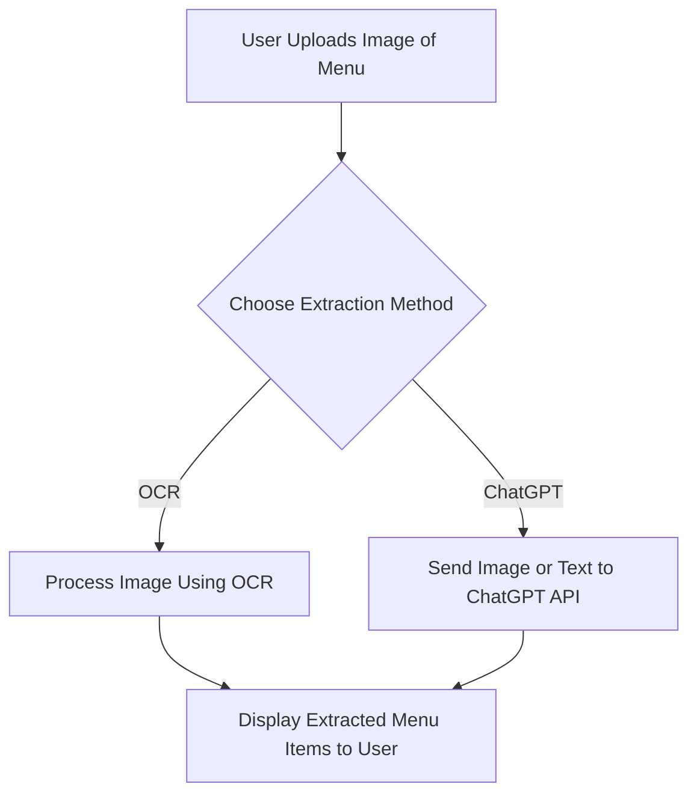

# mosaic-business-demo
This repo is public
<a id="readme-top"></a>

<details> <summary>Table of Contents</summary> <ol> <li> <a href="#about-the-project">About the Project</a> <ul> <li><a href="#built-with">Built With</a></li> </ul> </li> <li> <a href="#why-kotlin">Why Kotlin?</a> <ul> <li><a href="#key-features-of-kotlin">Key Features of Kotlin</a></li> <li><a href="#comparison-with-java">Comparison with Java</a></li> </ul> </li> <li> <a href="#menu-item-extraction-app-demo">Menu Item Extraction App Demo</a> <ul> <li><a href="#step-1-setting-up-your-environment">Step 1: Setting up Your Environment</a></li> <li><a href="#step-2-building-the-ui">Step 2: Building the UI</a></li> <li><a href="#step-3-implementing-dual-extraction-options">Step 3: Implementing Dual Extraction Options</a></li> <li><a href="#step-4-displaying-and-refining-results">Step 4: Displaying and Refining Results</a></li> </ul> </li> <li><a href="#system-diagram">System Diagram</a></li> <li><a href="#q-and-a-and-wrap-up">Q&A and Wrap-Up</a></li> </ol> </details>


# About the Project

This project introduces Kotlin, its benefits for Android development, and demonstrates building a Menu Item Extraction App. The app uses OCR and ChatGPT to extract text from images and display extracted menu items in a clean, user-friendly interface.
## Built With
  * Kotlin – for concise and modern Android development.
  * ML Kit (OCR) – for text recognition.
  * XML layouts – for building the UI.
  * Coroutines – for asynchronous programming.
  
<p align="right">(<a href="#readme-top">back to top</a>)</p>

# Why Kotlin?

## Key Features of Kotlin
### Conciseness:
  * Replace boilerplate Java code with shorter Kotlin code.

```java
// Java
public class User {
    private String name;
    private int age;
    
    public User(String name, int age) {
        this.name = name;
        this.age = age;
    }
}
```

```kotlin
// Kotlin
data class User(val name: String, val age: Int)
```

### Null Safety:
  * Eliminate NullPointerException errors at compile time.

```kotlin
val name: String? = null // Nullable variable
println(name?.length)    // Safe call operator
```
### Coroutines for Async Programming:
  * Simplified threading for network calls or heavy processing.

```kotlin
GlobalScope.launch {
    val data = fetchData() // Runs in the background
    updateUI(data)        // Updates on the main thread
}
```

### Extension Functions:
  * Add functionality to existing classes without modifying them.

```kotlin
fun String.capitalizeWords(): String {
    return split(" ").joinToString(" ") { it.capitalize() }
}
```

<p align="right">(<a href="#readme-top">back to top</a>)</p>


# Comparison with Java

| Feature           | Kotlin                                   | Java                           |
|-------------------|------------------------------------------|--------------------------------|
| Conciseness       | Reduces boilerplate code.               | Verbose, requires more code.  |
| Null Safety       | Built-in.                               | Requires manual checks.       |
| Async Handling    | Coroutines simplify async tasks.        | Relies on threads and callbacks. |
| Interoperability  | Seamlessly integrates with Java codebases. | Limited Kotlin support.       |
| Cross-Platform    | Focused on Android.                     | Ideal for desktop + Android.  |

<p align="right">(<a href="#readme-top">back to top</a>)</p>

# Menu Item Extraction App Demo
## Step 1: Setting up Your Environment

1. Install Android Studio:
  * Download Android Studio.
  * Configure Kotlin in your project.

2. Add Dependencies:
   * Add ML Kit and Coroutines dependencies in build.gradle.
    ```kotlin
    implementation "com.google.mlkit:text-recognition:16.0.0"
    implementation "org.jetbrains.kotlinx:kotlinx-coroutines-android:1.6.4"
    ```

   
<p align="right">(<a href="#readme-top">back to top</a>)</p>

## Step 2: Building the UI
 Use Jetpack Compose for modern UI design or traditional XML layouts.

 ### Jetpack Compose Example
 ```kotlin
  @Composable
  fun MenuScreen() {
      Column(
          modifier = Modifier.fillMaxSize(),
          horizontalAlignment = Alignment.CenterHorizontally,
      ) {
          Text("Menu Extraction App", fontSize = 24.sp)
          Button(onClick = { captureImage() }) {
              Text("Capture Menu")
          }
          LazyColumn {
              items(menuItems) { item ->
                  Text(text = item, fontSize = 18.sp)
              }
          }
      }
  }
```

### XML Layout Example
```XML
<LinearLayout
    android:layout_width="match_parent"
    android:layout_height="match_parent"
    android:orientation="vertical">

    <TextView
        android:id="@+id/header"
        android:text="Menu Extraction App"
        android:textSize="24sp" />

    <Button
        android:id="@+id/captureButton"
        android:text="Capture Menu" />

    <RecyclerView
        android:id="@+id/menuList"
        android:layout_width="match_parent"
        android:layout_height="wrap_content" />
</LinearLayout>
```

<p align="right">(<a href="#readme-top">back to top</a>)</p>

## Step 3: Implementing the OCR Feature
### Capture Image and Process with ML Kit
```kotlin
fun processImage(inputImage: InputImage) {
    val recognizer = TextRecognition.getClient()
    recognizer.process(inputImage)
        .addOnSuccessListener { result ->
            val extractedText = result.text
            updateMenuItems(extractedText)
        }
        .addOnFailureListener { exception ->
            Log.e("OCR", "Error: ${exception.message}")
        }
}
```

### Launch Image Picker
```kotlin
val imagePickerLauncher = registerForActivityResult(ActivityResultContracts.GetContent()) { uri ->
    uri?.let {
        val inputImage = InputImage.fromFilePath(context, it)
        processImage(inputImage)
    }
}
```


# System Diagram
Diagram Description:
The system diagram shows a single input (menu image) branching into two processes (OCR and ChatGPT). Both processes lead to the result being displayed to the user.


<p align="right">(<a href="#readme-top">back to top</a>)</p>

