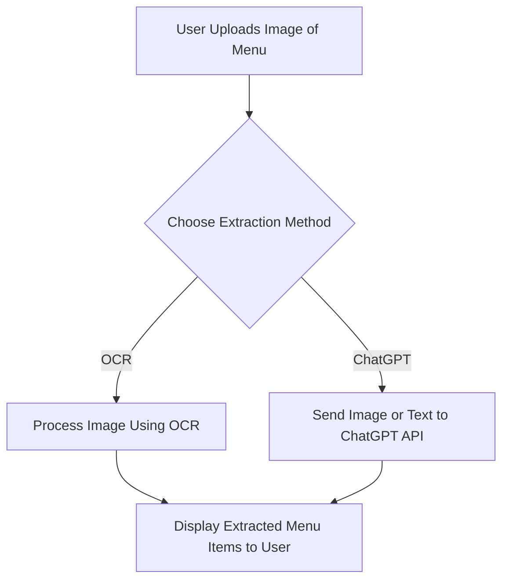

# mosaic-business-demo
This repo is public

 
Table of Contents
 <ol> <li> <a href="#about-the-project">About the Project</a> <ul> <li><a href="#built-with">Built With</a></li> </ul> </li> <li> <a href="#why-kotlin">Why Kotlin?</a> <ul> <li><a href="#key-features-of-kotlin">Key Features of Kotlin</a></li> <li><a href="#comparison-with-java">Comparison with Java</a></li> </ul> </li> <li> <a href="#menu-item-extraction-app-demo">Menu Item Extraction App Demo</a> <ul> <li><a href="#step-1-setting-up-your-environment">Step 1: Setting up Your Environment</a></li> <li><a href="#step-2-building-the-ui">Step 2: Building the UI</a></li> <li><a href="#step-3-implementing-dual-extraction-options">Step 3: Implementing Dual Extraction Options</a></li> <li><a href="#step-4-displaying-and-refining-results">Step 4: Displaying and Refining Results</a></li> </ul> </li> <li><a href="#system-diagram">System Diagram</a></li> <li><a href="#q-and-a-and-wrap-up">Q&A and Wrap-Up</a></li> </ol> 

#About the Project

This project introduces Kotlin, its benefits for Android development, and demonstrates building a Menu Item Extraction App. The app uses OCR and ChatGPT to extract text from images and display extracted menu items in a clean, user-friendly interface.

# System Diagram
Diagram Description:
The system diagram shows a single input (menu image) branching into two processes (OCR and ChatGPT). Both processes lead to the result being displayed to the user.

